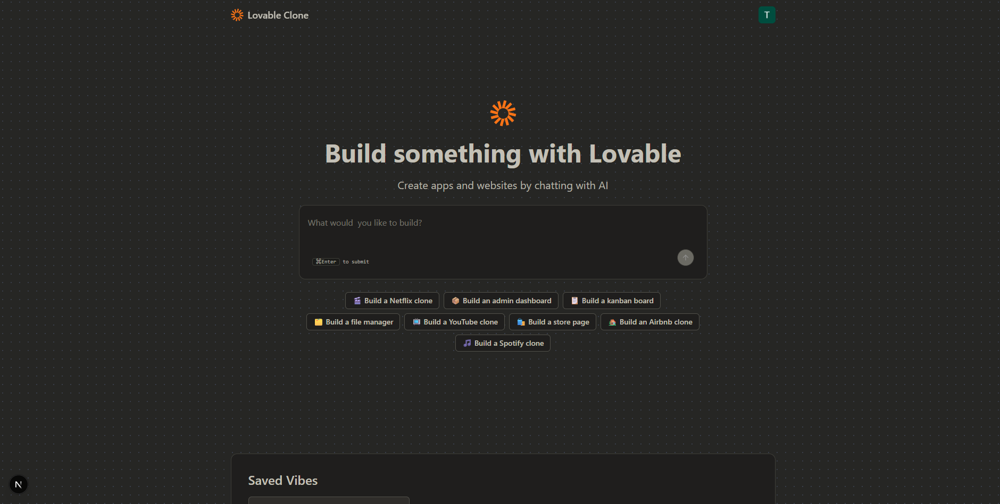
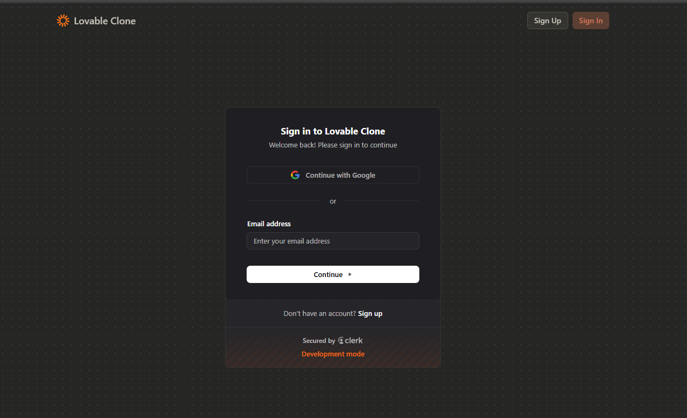

## Lovable Clone - Next.js + Claude + e2b sandboxes + Inngres

### Trpc

### Database - Neon (Postgres)

* You can prompt claude (or any supported LLM) to create your dream project
* Beware - it costs tokens based on the model

### Goal
* This project helped me understand how to communicate with Claude via API and how to connect an AI agent. The concept is that I can describe what kind of Next.js project I want to build, and the important part was creating a prompt for Claude that instructs it on what it should do. Then the user can see both the generated code and a live preview in the app

## Dashboard

## Login

!

## Pricing

[pricing.png](public/pricing.png)
